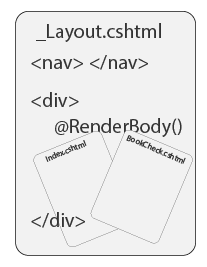

A website has a client and server.




A traditional server is a glorified folder.


The client is free to dig around.
```
localhost:XXXX/passwords.txt
```


MVC is a middle-man between the client and the files.

