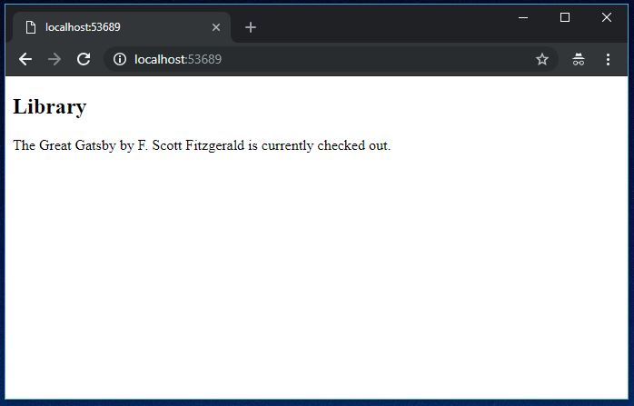
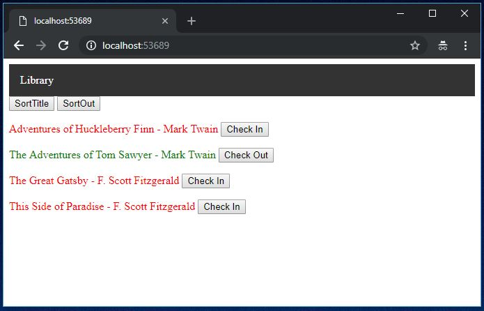
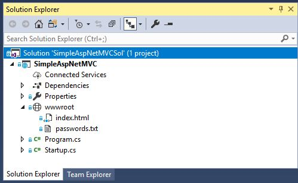
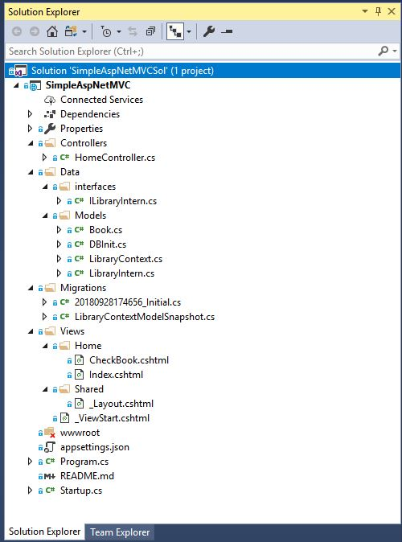

## Simple ASP.NET MVC Application

### What
Library to view and check-out books. Data stored in a database using the EntityFramework. This is intended for beginners who are overwhelmed by the default Visual Studio MVC app.

Subjects: ASP.NET, MVC, C#, Class, Interface, HTML, CSS, Razor Syntax, Database, EntityFramework, SQLite, LINQ, Dependency Injection. 

I learned a lot from: https://github.com/etrupja/DrinkAndGo


### Transformation: 

Application slowly progresses from an HTML page to an interactive website. Steps are separated into branches.

 

 


### Try:

To run the final version:

Clone the Repo
```
git clone https://github.com/duffcon/SimpleAspNetMVC.git
```

Open Solution in Visual Studio

Create the database
```
[Package Manager Console]
cd SimpleAspNetMVC
Update-Database
```

Run IIS Express
