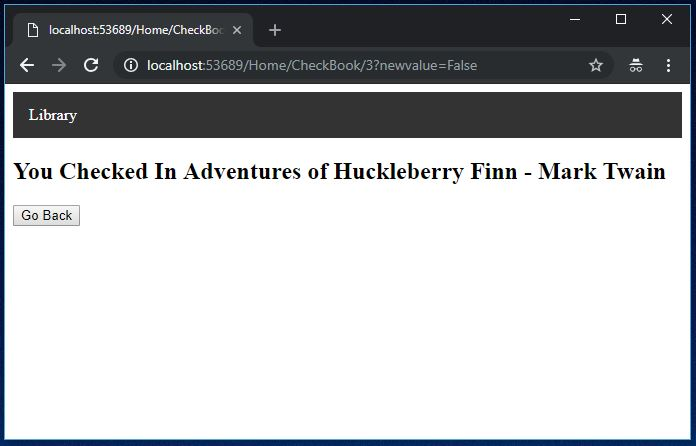

## Simple ASP.NET MVC Application

### What
ASP.NET application that checks-out books and saves the status to a database. This is intended for beginners who are overwhelmed by the default Visual Studio MVC app.

Subjects: ASP.NET, MVC, C#, Class, Interface, HTML, CSS, Razor Syntax, Database, EntityFramework, SQLite, LINQ, Dependency Injection. 

I learned a lot from: https://github.com/etrupja/DrinkAndGo


### Start: 


### End:




To run the final version:

Clone the Repo
```
git clone
```

Open Solution in Visual Studio

Create the database
```
[Package Manager Console]
cd SimpleAspNetMVC
Update-Database
```

Run IIS Express
